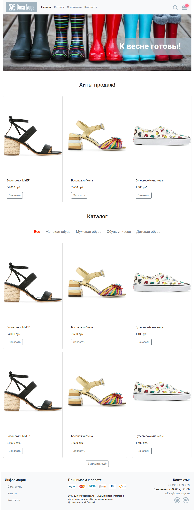
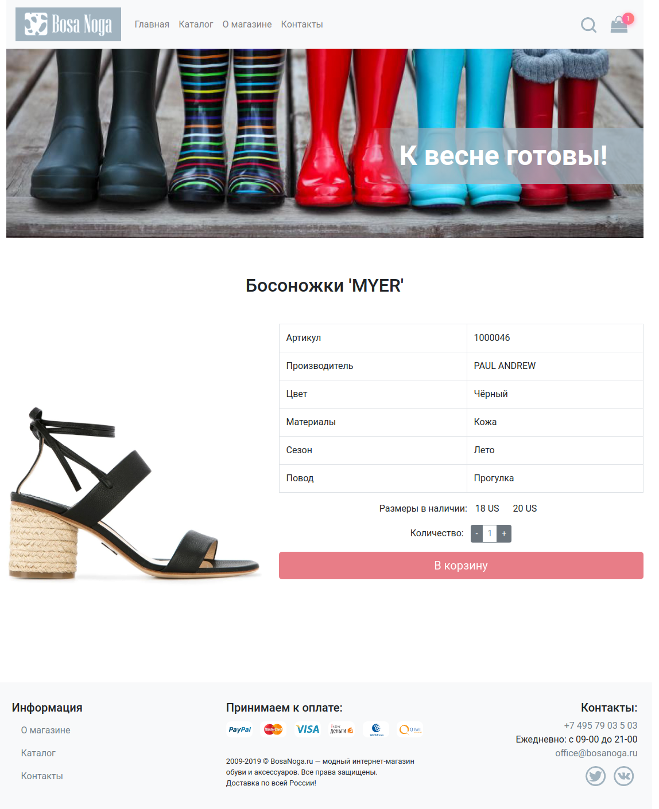

### Доступные команды

- `npm install` - установить зависимости
- `npm run prepare` - запустить тесты и проверить стиль кода
- `npm run test` - запустить тесты
- `npm run codestyle` - проверить стиль кода
- `npm run start` - запустить встроенный сервер и следить за изменениями файлов
- `npm run build` - собрать проект в папку `build`

## Содержание

Приложение содержит следующие самостоятельные экраны (страницы):

1. Главная страница
1. Каталог товаров
1. Информационная страница
1. Страница товара
1. Корзина
1. 404

## Переходы между экранами

Навигационным центром приложения являются шапка и футер каждого экрана (страницы):

Из шапки можно попасть на следующие экраны:

- Логотип и ссылка "Главная" - ведут на главную страницу, URL - "/"
- Каталог - ведёт на страницу каталога, URL - "/catalog.html"
- О магазине - ведёт на страницу "О магазине", URL - "/about.html"
- Контакты - ведёт на страницу "Контакты", URL - "/contacts.html"

Из футера можно попасть на следующие экраны:

- О магазине - ведёт на страницу "О магазине", URL - "/about.html"
- Каталог - ведёт на страницу каталога, URL - "/catalog.html"
- Контакты - ведёт на страницу "Контакты", URL - "/contacts.html"

## Описание экранов

### Главная страница

Экран «Главная страница» доступен по умолчанию при открытии приложения.

При загрузке любых данных с помощью сетевых запросов должен отображаться лоадер. У каждого "виджета" лоадер свой (т.е. у вас не должно быть одного лоадера на всё приложение).

После загрузки страница выглядит следующим образом:

Общая схема:

Вам нужно реализовать:

1. Хиты продаж - GET http://localhost:7070/api/top-sales. В ответ приходит JSON, содержащий данные. Вам необходимо его распарсить и вывести элементы. Если в ответе пришёл пустой массив (т.е. хитов продаж нет), то компонент не должен ничего отображать (как и не должен занимать места на экране).

1. Категории каталога - GET http://localhost:7070/api/categories. В ответ приходит массив категорий без элемента "Все" (его вы должны добавить сами). По умолчанию выбранный элемент служит для определения того, какие будут загружаться товары из каталога (т.е. "Все" - загружаются все, "Женская обувь" - загружается только женская обувь). Активный элемент выделен. При смене категории делается новый запрос, предыдущие загруженные данные удаляются.

1. Элементы каталога - GET http://localhost:7070/api/items (для варианта "Все"). При другой выбранной категории, вы делаете запрос вида GET http://localhost:7070/api/items?categoryId=X. Возвращается массив элементов, соответствующих вашему запросу.

1. Загрузить ещё - при запросе элементов каталога загружаются следующие 6. При нажатии на "Загрузить ещё" загружаются ещё 6: GET http://localhost:7070/api/items?offset=6 (где `offset` определяет сколько элементов пропустить). Если сервер вернул пустой массив или меньше 6 элементов, то кнопка "Загрузить ещё" должна исчезнуть. На время загрузки над кнопкой так же показывается лоадер, сама кнопка отключается.

Обратите внимание, при загрузке по кнопке ещё должна учитываться выбранная категория: т.е. выбрана категория Женская обувь, то при нажатии на ещё делается запрос GET http://localhost:7070/api/items?categoryId=X&offset=6 (и т.д.)

Рекламный баннер и текст на нём являются статичными.

### Каталог товаров

Экран «Каталог товаров» должен выглядеть следующим образом:

Фактически, он полностью повторяет функциональность каталога на главной странице, за одним исключением: у него есть поле поиска.

При заполнении этого поля отправляется запрос вида: GET http://localhost:7070/api/items?q=<текст в строке поиска>. При этом все правила относительно категории, кнопки "Загрузить ещё" сохраняются.

Если категория меняется, то данные перезагружаются с учётом строки поиска.

Строка поиска реагирует только на полный ввод (не live-поиск).

### Поиск

Поиск на сервере работает по точному совпадению цвета (без учёта регистра, например "черный") и по содержанию слова для названия (без учёта регистра, например можно найти "жар" в "Туфли Жар-птицы").

### О магазине, Контакты

Это просто контентные страницы, в которые жёстко зашит контент. Никакой логики (кроме работы виджета поиска и ссылок) там нет.

### Страница товара

Страница товара выглядит следующим образом:

Страница открывается при нажатии кнопок "Заказать" в карточках товаров. URL - /catalog/:id.html. Где id - это id товара.

На ней интерес представляет только блок самого товара:

Ключевые моменты:

1. При загрузке показывается лоадер
1. Для загрузки полной информации о товаре нужно сделать GET http://localhost:7070/api/items/:id, где id - это id товара
1. Слева выводится картинка (в ответе может быть несколько картинок - вы берёте первую)
1. Сбоку выводится табличка с данными (все необходимые данные перечислены). Других - не нужно. Если каких-то в приходящем товаре не будет, то просто оставляете поле пустым.
1. Размеры - выводятся все доступные размеры (у которых флаг `available` равен `true`). По умолчанию ни один размер не выбран. После выбора он становится выделенным, как на скриншоте. Важно: кнопка "В корзину" активируется только тогда, когда есть размеры в наличии и выбран конкретный размер. Размер можно выбрать только один.
1. Количество - от 1 до 10.

Особые случаи: если ни одного размера не доступно, блок Количество и кнопка "В корзину" не отображаются.

После нажатия на кнопку "В корзину" пользователь перемещается в страницу корзины /cart.html.

### Страница корзины

В корзину можно попасть либо заказав что-то, либо кликнув на иконку корзины в шапке сайта.

Блок корзина - отображает товары, находящиеся в корзине. Все товары хранятся локально в localStorage. Товар можно удалить из корзины (тогда он должен удалиться и из localStorage тоже)

Одной позицией считается пара - Товар + Размер. Т.е. если купить те же босоножки другого размера, то это будет две позиции в корзине. А если два раза купить босоножки того же размера - то изменится количество и общая стоимость (но запись останется в табличке одна).

Важно: стоимость должна фиксироваться при покупке - т.е. вы кладёте в localStorage именно ту стоимость за единицу, которая была в тот момент, когда пользователь нажал "В корзину".

Общая сумма расчитывается на базе суммирования всех позиций при отображении.
